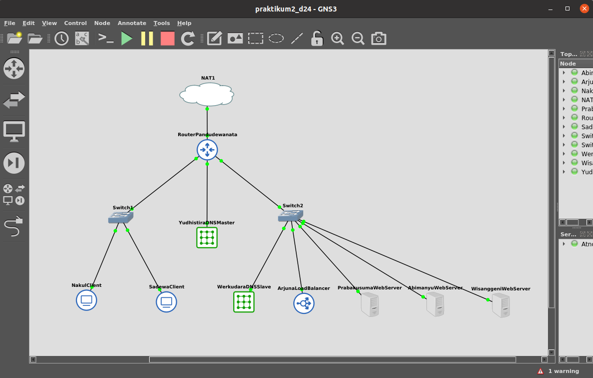
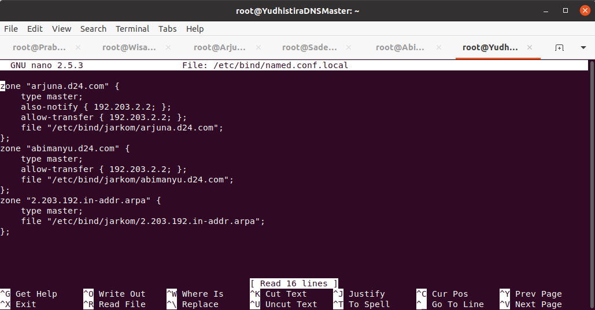
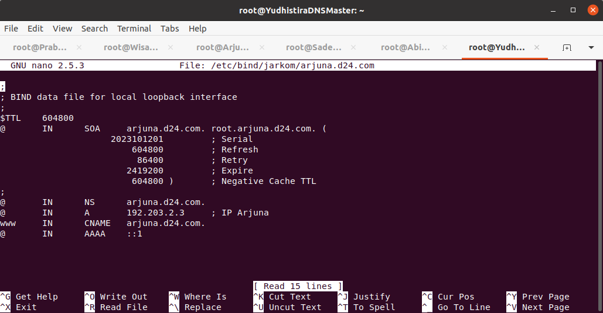

# Jarkom-Modul2-D24-2023
Laporan Praktikum Kelas Jaringan Komputer 2024
Kelompok D24.

<ul>
  <li>Daffa Saskara - 5025211249</li>
  <li>Arundaya Pratama Nurhasan - 5025221205</li>
</ul>

## No.1
Yudhistira akan digunakan sebagai DNS Master, Werkudara sebagai DNS Slave, Arjuna merupakan Load Balancer yang terdiri dari beberapa Web Server yaitu Prabakusuma, Abimanyu, dan Wisanggeni.

Berdasarkan model topologi yang diberikan maka didapat hasil seperti gambar diatas

## No.2
Buatlah website utama pada node arjuna dengan akses ke arjuna.yyy.com dengan alias www.arjuna.yyy.com dengan yyy merupakan kode kelompok.

Setelah melakukan instalasi `bind9` kemudian kita mengatur zona DNS dengan mengubah file `named.conf.local` yang berada di dalam `/etc/bind/` menjadi gambar diatas. Membuat zona `arjuna.d24.com` dengan `type master` dan mengarahkannya ke `file "/etc/bind/jarkom/arjuna.d24.com"`

Setelah itu membuat folder `jarkom` di dalam `/etc/bind/` dan membuat file `arjuna.d24.com` di dalamnya seperti gambar diatas. Dengan alamat IP yang mengarah ke Arjuna dan `www` sebagai alias dari webserver tersebut.

## No.3
Dengan cara yang sama seperti soal nomor 2, buatlah website utama dengan akses ke abimanyu.yyy.com dan alias www.abimanyu.yyy.com.

Dengan cara yang sama seperti nomor sebelumnya kita membuat file `abimanyu.d24.com` di dalam `/etc/bind/abimanyu`. Kemudian membuat IP yang mengarah ke Abimanyu dan `www` sebagai alias dari `abimanyu.d24.com`. Selanjutnya kita mengubah file `/etc/bind/named.conf.local` untuk membuat `zone abimanyu.d24.com` dan menambahkan `type master` kemudian mengarahkannya ke `file "/etc/bind/jarkom/arjuna.d24.com"`

## No.4
Kemudian, karena terdapat beberapa web yang harus di-deploy, buatlah subdomain parikesit.abimanyu.yyy.com yang diatur DNS-nya di Yudhistira dan mengarah ke Abimanyu.

Untuk membuat subdomain kita bisa langsung menambahkan `parikesit` pada DNS Record dengan mengarahkan alamatnya langsung ke IP Abimanyu

## No.5
Buat juga reverse domain untuk domain utama. (Abimanyu saja yang direverse)

Untuk membuat reverse kita harus membuat `zone`-nya dulu yaitu dengan mengubah file `/etc/bind/named.conf.local` dan menambahkan `zone "2.203.192.in-addr.arpa"` dengan `type master` kemudian diarahkan ke `file "/etc/bind/jarkom/2.203.192.in-addr.arpa"`

selanjutnya kita membuat file `2.203.192.in-addr.arpa` di dalam `/etc/bind/jarkom` dengan menuliskan IP Abimanyu secara terbalik untuk mengarahkan record `NS` dan `PTR` ke `abimanyu.d24.com`

## No.6
Agar dapat tetap dihubungi ketika DNS Server Yudhistira bermasalah, buat juga Werkudara sebagai DNS Slave untuk domain utama.

Pertama kita mengubah file `/etc/bind/named.conf.local` dan menambahkan `allow-transfer { IP tujuan; }` dalam hal ini IP Abimanyu dan Arjuna

Kemudian mengubah file `/etc/bind/named.conf.local` pada `Werkudara` untuk menambahkan `zone "arjuna.d24.com"` dan `zone "abimanyu.d24.com"` yang keduanya ber-`type slave` dan memiliki `masters { 192.203.1.2; }`. Selanjutnya arahkan keduanya ke file masing-masing yaitu `"/var/lib/bind/arjuna.d24.com"` untuk arjuna dan `"/var/lib/bind/abimanyu.d24.com"` untuk abimanyu.

## No.7

